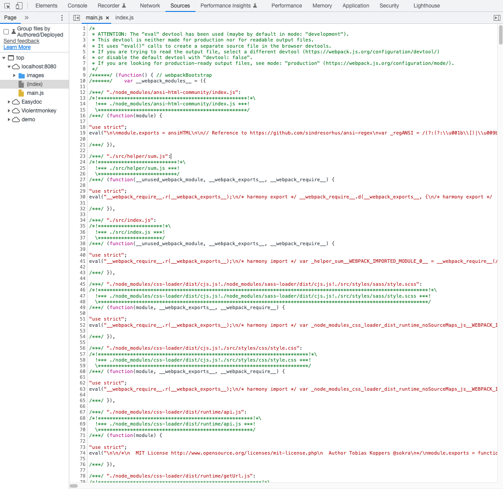

项目开发中难免会遇到各种错误，随着项目体积的增大快速定位错误代码就显得尤为重要。开发中运行的代码是经过webpack编译处理的，比如下面这个截图：



很明显，这种编译后的代码对于我们快速定位问题几乎起不到什么帮助。

## Source Map

​	Source map（源码映射）是一个用来生成源代码与构建后代码一一映射的文件的方案。它会生成一个 `.map` 格式文件，里面包含源代码和构建后代码每一行、每一列的映射关系等。当构建后代码出错了，会通过 `.map` 文件，从构建后代码出错位置找到映射后源代码出错位置，从而让浏览器提示源代码文件出错位置，帮助我们更快的找到错误根源。

​	官网介绍的devtool的配置有20+种，每种都可以用在某个（些）特定的场合或者满足某种需求，不过总的来说这些配置都满足以下的格式，这20+种配置只不过是几个字符串的组合：

```
[inline-|hidden-|eval-][nosources-][cheap-[module-]]source-map
```

这其中每个关键字都代码不同的含义：

* inline：Source Map内容通过base64放在js文件中引入
* hidden：代码中没有sourceMappingURL，浏览器不自动引入Source Map
* eval：生成代码和Source Map内容混淆在一起，通过eval输出
* nosource：使用这个关键字的Source Map不包含sourcesContent，调试时只能看到文件信息和行信息，无法看到源码
* cheap[module]：这个关键字用于指定调试信息的完整性
* cheap：不包含列信息，并且源码是进过loader处理过的
* cheap-module：不包含列信息，源码是开发时的代码

关于每种配置具体在打包中大声的Source Map样子，可以参考 [官方Examples文档](https://github.com/webpack/webpack/tree/main/examples/source-map) 。

## 配置

[Webpack Devtool](https://webpack.js.org/configuration/devtool/) 用来控制源码映射方式，其配置有多种选项，但通常来说我们只需关注两种情况即可：

### 开发模式

开发模式推荐使用 `cheap-module-source-map` 配置，因为开发模式我们的代码通常不会很长，所以定位到错误所在行（行映射）基本就能满足我们定位到问题代码的需求。

* 优点：打包编译速度快，只包含行映射
* 缺点：没有列映射

```javascript
module.exports = {
  ...
  mode: "development",
  devtool: "cheap-module-source-map",
};
```

### 生产模式

生产模式推荐使用 `hidden-source-map` 的配置，生产模式下webpack会将代码压缩处理导致每行代码通常很长，这样错误信息能同时定位到行/列，同时生产环境下为了安全性使用 `hidden` 关键字从而Source Map不会被暴露出去。

* 优点：能同时定位到行/列，安全性好
* 缺点：打包编译速度更慢

```javascript
module.exports = {
  ...
  mode: "production",
  devtool: "hidden-source-map",
};
```

注意：在修改配置后我们需要重启服务或者重新打包，以使配置生效，并且 `deltool` 要与 `mode` 来一起配合使用。


参考资料：

* [Devtool 官方文档](https://webpack.js.org/configuration/devtool/)
* [Source Maps](https://survivejs.com/webpack/building/source-maps/)
* [一文彻底搞懂webpack devtool](https://juejin.cn/post/6844904201311485966)